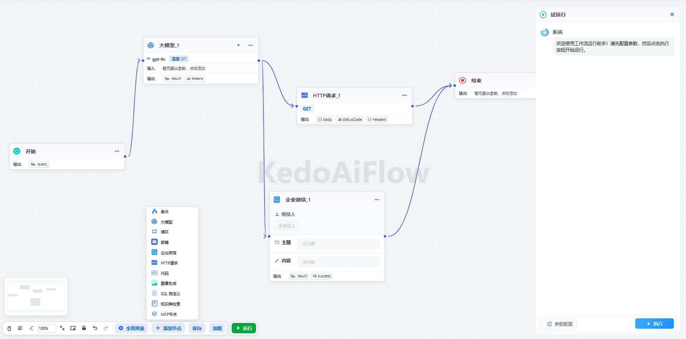

# Kedo - Process Intelligence Agent Development Platform (Open Source)

Welcome to the **Kedo** open-source project! **KedoFlow** is a process intelligence agent development platform built on large language models (LLMs), designed to help developers quickly build and deploy intelligent business workflows. This project supports React for frontend development, with backend support for both **.NET Core** and **Java**, making it suitable for a wide range of application scenarios.

Below are detailed project information, open-source licenses, usage guides, and important notes.

---

## 1. Project Overview

### 1.1 Key Features
- **LLM-Powered Capabilities**: Integrated with advanced large language models such as DeepSeek, ChatGPT, Qwen, Claude, etc., providing strong natural language processing capabilities. Easy to extend with new models.
- **Customizable Workflow Agents**: Enables developers to define logic and automate tasks.
- **Multi-Language Backend Support**: Supports both .NET Core and Java backends to meet diverse team requirements.
- **Modern Frontend Framework**: Built with React for a smooth and responsive user experience.
- **Multilingual Support**: Available in Chinese and English to serve international teams.

### 1.2 Technology Stack
- **Frontend**: React + TypeScript
- **Backend**:
  - .NET Core
  - Java (Spring Boot)
- **Database**: Supports MySQL, PostgreSQL, and other major relational databases
- **Other Dependencies**: Can be extended with third-party services as needed

---

## 2. Open Source License

Kedo follows the **Apache 2.0 License** with additional restrictions. Please read the following carefully:

### 2.1 Apache 2.0 License Highlights
- You may freely use, modify, and distribute the code.
- If you modify the code, you must clearly indicate the changes made.
- You must include the original license and copyright notice when distributing copies.

### 2.2 Additional Terms
In addition to the Apache 2.0 License, we have added the following terms:
1. **Commercial Use Authorization**: If you plan to use KedoFlow for commercial purposes (e.g., resale, rental, or service provision), prior written authorization is required. Contact us at: **kedoai@kedowen.com**.
2. **Logo Usage Restrictions**: Modification or removal of the KedoFlow logo or branding is not permitted without explicit permission.
3. **Disclaimer of Warranty**: The software is provided "as-is" without any warranties, express or implied. Please ensure thorough testing before use.

For more details, please refer to the [LICENSE file](LICENSE).

---

## 3. Installation & Usage Guide

### 3.1 Clone the Repository
```bash
git clone https://gitee.com/kedoai/kedo.git
cd kedo
```

### 3.2 Run the Project

#### 1. Docker One-Click Deployment (Recommended)

To simplify local deployment, KedoFlow provides a one-click Docker-based deployment solution. You can use `docker-compose` to quickly start a complete development/testing environment including frontend, backend, and database services.

##### 1. Install Dependencies

Make sure your system has the following tools installed:

- [Docker](https://www.docker.com/)
- [Docker Compose](https://docs.docker.com/compose/install/)

##### 2. Start the Project

Run the following command in the project root directory:

```bash
# Build and start all services
docker-compose -f docker-compose.yml up -d
```

> This will automatically build or pull the necessary images and start the following services:
> - React frontend app (default port: 3000)
> - .NET Core or Java backend service (default port: 5000 or 8080)
> - MySQL database (default port: 3306)
> - Optional: Redis, MinIO, and other third-party services (if configured)

##### 3. Access the Platform

Open your browser and navigate to:

```
http://localhost:3000
```

You should now see the KedoFlow platform interface.

#### 2. Local Setup (Manual)

##### 1. Frontend Setup

Navigate to the frontend directory and install dependencies:

```bash
cd frontend
npm install
npm start
```

##### 2. Backend Setup

**.NET Core Backend**
```bash
cd backend/dotnet
dotnet restore
dotnet run
```

**Java Backend**
```bash
cd backend/java
./mvnw clean install
java -jar target/kedo.jar
```

##### 3. Database Configuration

Edit the `application.properties` or `appsettings.json` file to configure the database connection.

##### 4. Run Tests

After starting both frontend and backend services, access the default URL (e.g., http://localhost:3000) to explore the platform.

---

### 3.3 Default Account and Password  
Default username: **15188886666**  
Default password: **123456**

## 4. Contribution Guidelines

We welcome contributions from the community! Here’s how you can get involved:

1. **Fork the Project**: Click the "Fork" button on the top-right corner of the GitHub page.
2. **Clone the Code**: Clone your forked repository to your local machine.
3. **Create a Branch**: Create a new branch based on the main branch for your development.
4. **Commit Changes**: Commit your changes and push them to your remote repository.
5. **Submit a Pull Request**: Submit a PR to the main repository and describe your changes.

Please follow the project's coding style and guidelines.

---

## 5. Contact Us

If you have any questions or need further assistance, please contact us through the following channels:

- **Official Website**: [www.kedowen.com](http://www.kedoai.com)
- **Email**: kedoai@kedowen.com
- **GitHub Issues**: Submit issues or suggestions via the Issues tab on GitHub

---

## 6. Copyright Notice

Kedo and its associated logos and brand identities are the property of **KedoWen Inc.**. Unauthorized copying, distribution, or commercial use is strictly prohibited.

Thank you for choosing Kedo! We hope our platform adds value to your projects.

